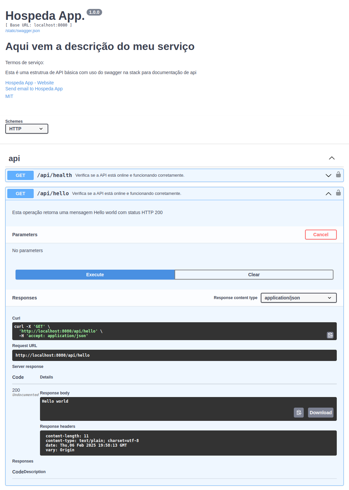

# Exemplo de API com Swagger

Documentação é gerada no build da imagem, através do comando 
```swagger generate spec -o ./swagger-ui/swagger.json```  
o json com a documentação é gerada dentro da pasta swagger-ui 
onde há o arquivo index.html que irá usar swagger-ui para carregar o arquivo swagger.json

```sh
docker-compose up --build --remove-orphan
```

## Exemplo


