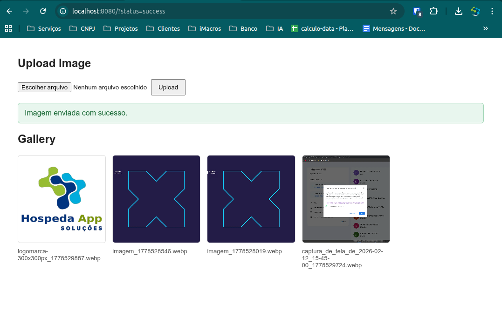

# Go Image Upload

Aplicacao web simples em Go para fazer upload de imagens, converter os arquivos enviados para WebP e exibir uma galeria com as imagens salvas na pasta `uploads`.

## Print do sistema



## Funcionalidades

- Upload de imagens pelo navegador.
- Conversao automatica da imagem enviada para WebP.
- Salvamento dos arquivos na pasta `uploads`.
- Listagem das imagens enviadas em uma galeria.
- Mensagem de sucesso quando o upload termina corretamente.
- Mensagem de falha quando o upload nao pode ser processado.
- Registro do erro no terminal em caso de falha.

## Tecnologias

- Go
- HTML
- CSS
- Biblioteca `github.com/chai2010/webp` para gerar imagens WebP.

## Como executar

1. Instale as dependencias:

```bash
go mod tidy
```

2. Inicie o servidor:

```bash
go run .
```

3. Acesse no navegador:

```text
http://localhost:8080
```

## Como usar

Na tela inicial, selecione uma imagem no campo de upload e clique em `Upload`.

Se o envio for concluido com sucesso, a aplicacao exibe a mensagem `Imagem enviada com sucesso.` e a nova imagem aparece na galeria.

Se ocorrer algum erro, a aplicacao exibe uma mensagem de falha na tela e mostra o detalhe do erro no terminal onde o servidor esta rodando.

## Estrutura do projeto

```text
.
├── main.go
├── go.mod
├── go.sum
├── print.png
├── templates
│   └── index.html
└── uploads
    └── imagens enviadas
```

## Observacoes

- O limite de upload configurado e de 20 MB.
- As imagens enviadas sao salvas com um timestamp no nome para evitar sobrescrita.
- A rota `/uploads/` serve os arquivos da pasta `uploads` para exibicao na galeria.
